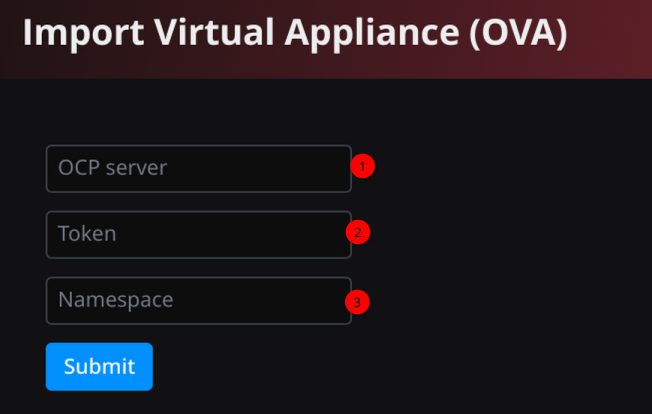
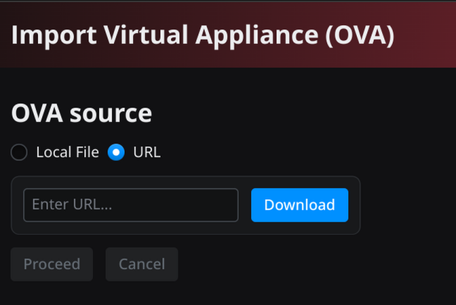
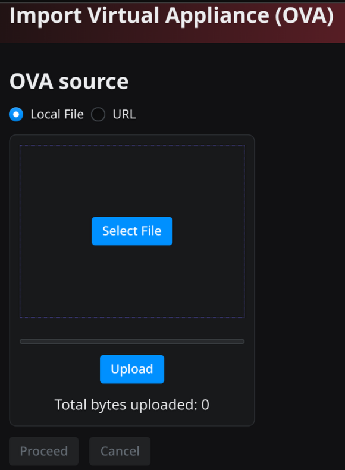
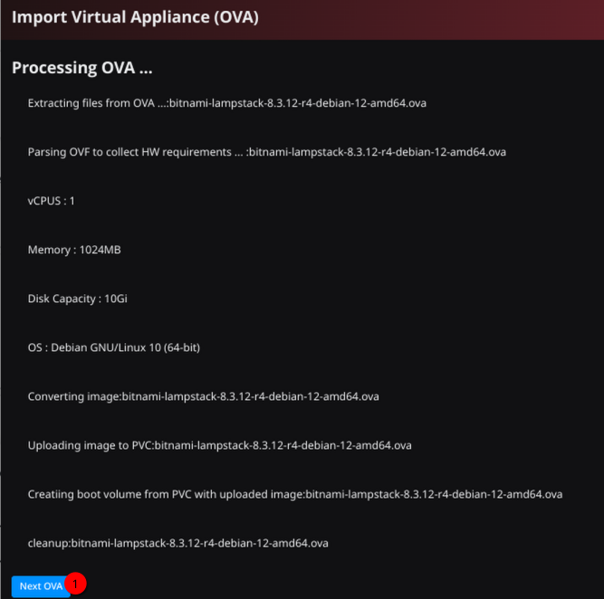

# Web based OVA Importing tool

Created with https://reflex.dev/

# Deploying:
To run direcly:

[source, bash]
----
python -m venv .venv
source .venv/bin/activate
pip install -r requirements.txt 
reflex run
----

To run in a container, after building the container image with the provided `Containerfile`, you need to set the `API_URL` enviroment variable, and expose both frontend (3000) and backend (8000) ports as follow:

[source, bash]
----
podman run -d -p 3000:3000 -p 8000:8000 -e API_URL=http://<address-of-host>:8000 -v <some-temporary-directory>:/tmp/ovas --name ovaimporter ovaimporter:latest
----

Manifests file to deploy in an OCP cluster, are provided under `k8s-manifests`. In current implementation, the disk capacity in the PVC should be about 3 times the size of the largest OVA expected so it can hold the OVA, the original VMDK and the resulting QCOW2 files.  OCP routes are used to point to the backend, if a different mechanism is used you will need to set the `API_URL` in `configmap.yaml` accordingly

## Usage:

Once deployed you open the application's URL in your browser (the URL depends on the deployment method, for the direct method it will be `http://localhost:5000`) and you will be asked to provide some information about your OCP cluster as show in Figure 1 below.

.OCP login page
[#img-ocplogin, caption="Figure 1: ",]

. Enter in this field the full URL to your OCP's console
. Your API token. To generate a token use the 'Copy login command' in the OCP console under your username (top right corner)
. The project/namespace where you want to create the bootable volumes

Once you submit the OCP login information, you will be presented with two options:

. Get the OVA directly from the source (see Figure 2)
. Upload the OVA from your computer (see Figure 3)

In both cases, after the OVA has been uploaded/downloaded into the temporary storage used by the application, you can click on the proceed button, which will lead to the status page where you can follow the progress of the importing process. When the process is finish, you can repeat with process by clicking on the "Next OVA" button at the bottom of the status page (see Figure 4). 

.Get OVA from URL
[#img-ova-from-url, caption="Figure 2: ",]

.Get OVA from URL
[#img-ova-from-url, caption="Figure 3: ",]

.Status/Progress page
[#img-ova-from-url, caption="Figure 4: ",]

.Disclaimer

****

Red Hat does not provide commercial support for the content of this repo

----
#############################################################################
DISCLAIMER: THE CONTENT OF THIS REPO IS EXPERIMENTAL AND PROVIDED **"AS-IS"**

THE CONTENT IS PROVIDED AS REFERENCE WITHOUT WARRANTY OF ANY KIND, EXPRESS OR
IMPLIED, INCLUDING BUT NOT LIMITED TO THE WARRANTIES OF MERCHANTABILITY,
FITNESS FOR A PARTICULAR PURPOSE AND NONINFRINGEMENT.
#############################################################################
----
****